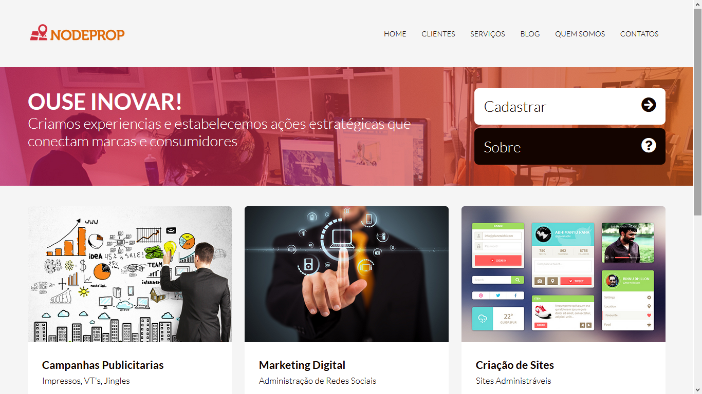
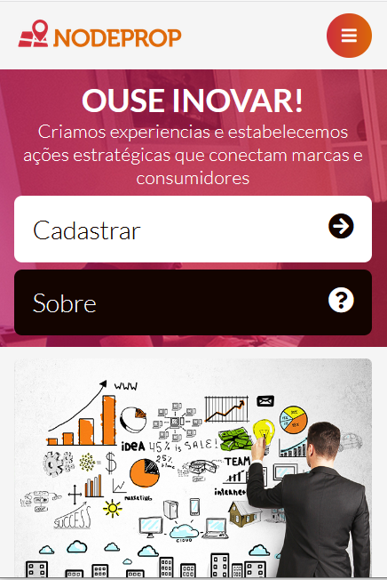

# NodeProp
A simple project to practice the basics of HTML, CSS, JavaScript and responsive design

## About the project

Responsive website developed during the tutorial: <a href="https://www.youtube.com/playlist?list=PLwXQLZ3FdTVFi6oHo_K4IYDcwCU5-f1x5">Responsive Design</a> of the channel <a href="https://www.youtube.com/c/NodeStudioTreinamentos" >Node Studios Treinamentos</a> 

<ul>
<li> access the page <a href="https://lucavini.github.io/NodeProp/">here</a> </li></ul>

  

